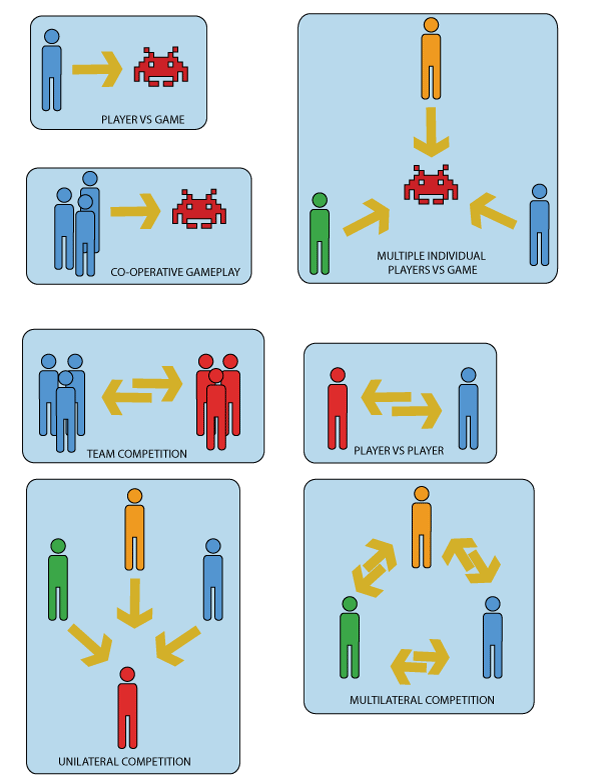

## Tic-Tac-Toe Rules

Play a game of Tic-Tac-Toe and use it to complete a list of rules on the Tic-Tac-Toe 2.0 Design Google Doc.

[Tic-Tac-Toe](https://www.google.com/search?q=play+tic+tac+toe&rlz=1C1GCEU_enUS892US892&oq=play+tic+tac+toe&aqs=chrome..69i57j0l2j46j0l3j69i61.2493j0j7&sourceid=chrome&ie=UTF-8&safe=active&ssui=on)

## Player Interaction Models

### Discussion

*Question: For each player interaction model, list a game that What are games that demonstrate each player interaction model?*

## Redesigning Tic-Tac-Toe

Use the player interaction models to redesign Tic-Tac-Toe 2.0 for 3-5 players.

Tic-Tac-Toe 2.0 Design Google Doc ( <https://docs.google.com/document/d/1kCGvDyAp7PNLFYhCkiIzpbM6KMwD5K7LlB6c7bn6L1A/copy> )
